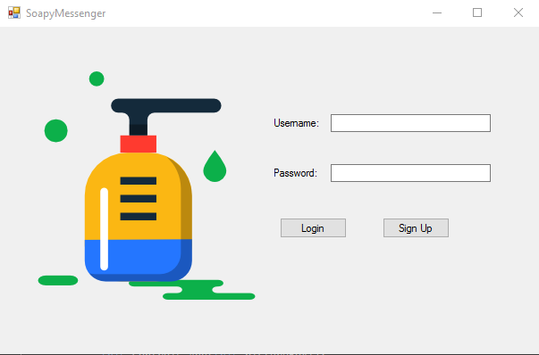
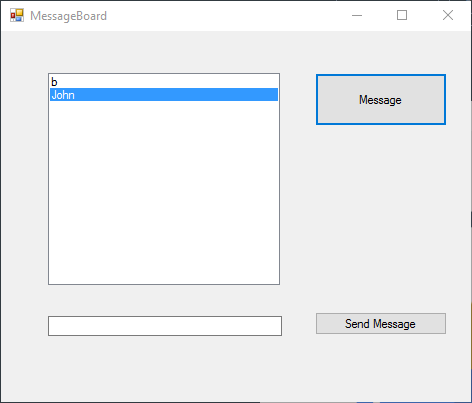
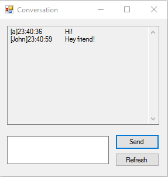

# SoapyMessenger

SoapyMessenger is a simple messaging application. It is hosted by a Windows Service implemented using WCF.  
Clients communicate with the server with a SOAP web service. The interface was made using Windows Forms.  
The application has authentication and allows you to message users.

# Application Interface

As said previously, the interface was kept very simple as this project was only meant to experiment with the underlying technologies.

Here is the login screen where a user can both sign up and enter the application with their credentials. Error messages such as creating a user with an existing username or invalid password would be show in the bottom of the screen.

After logging in the following screen is the message board. This displays the users you have messaged previously and allows you to message a new user.

Finally, the conversation screen is where you can message the selected user.

